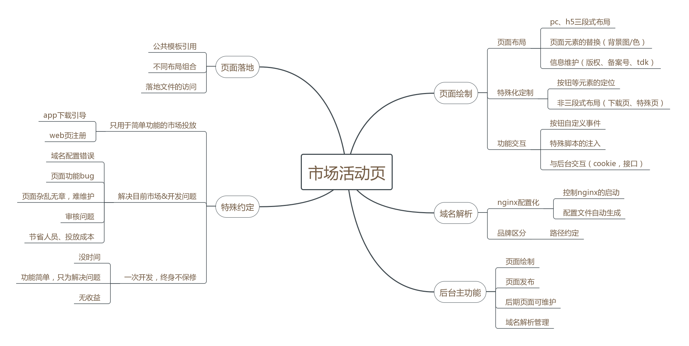

# shorthair
基于vue，koa 实现 **可视化运营页面** 管理平台

技术栈：vue+koa+mongo

## 契机
市场为增加用户数量，app下载量，会经常通知前端输出不同的推广页，投放在不同渠道。但随着业务线增多，工作量的倍增，加上开发重心在主业务线，缺少系统的验收流程，不可避免暴露一些生产问题，影响投放。

基于此原因，前端直接介入，以减少开发量，使市场能够顺利开展业务为目的。着手开发一个可视化运营页面可搭建平台。

## 期望解决的问题
- 功能异常、Bug
- 页面文案错误，造成 **审核被拒**
- 域名配置繁琐，解析错误
- 开发工作量大。活动页虽简单，但杂而乱。

简单一句话：未来系统开发屁事没有，一切你们业务部门自行hold住

## 解决方案
- 交付给市场管理，减少开发接触
- 多业务线同一系统处理输出，减少差异化
- Node主动域名解析，绕过Nginx的维护
- 通过Mongo，使页面配置等信息持久化

## 功能简介

# TODO LIST
待解决问题
- [ ] 技术栈选型
- [ ] 实现类似JSFiddle等效果
- [ ] 页面效果实现
- [ ] 域名的代理、解析

框架
- [ ] 项目框架搭建 Koa
- [ ] UI框架选择 ElementUI
- [ ] mongo配置，数据库创建

页面绘制
- [ ] 页面在线编辑（元素定位配置、同步展示）
- [ ] 模板实现——普通布局（注册功能、App下载）
- [ ] 模板实现——特殊布局（轮播图、产品展示）
- [ ] 信息维护（市场可配置页面元素，TDK，版权，备案号等信息）
- [ ] 功能逻辑（注册、下载、Button效果）

页面落地
- [ ] 模板之间的组合输出
- [ ] 最终页面的落地输出

域名解析
- [ ] Node or Nginx解析选型
- [ ] 多业务线解析规则

# 参考
[Baidu h5 制作](https://h5.bce.baidu.com)
[页面可视化搭建工具前生今世——掘金](https://juejin.im/post/5b0324f4518825426a20008d)
[vue-mintui 效果展示](https://github.com/mint-ui/docs/blob/master/src/components/phone.vue)
[virtual document VNode实现](https://segmentfault.com/a/1190000008291645)
[koa和egg项目webpack内存编译和热更新实现——segmentfault](https://segmentfault.com/a/1190000009377030)